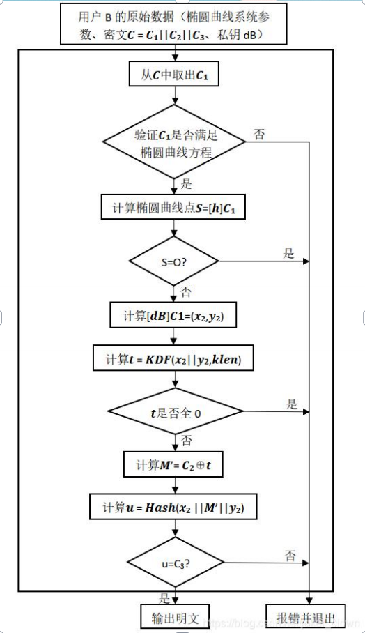
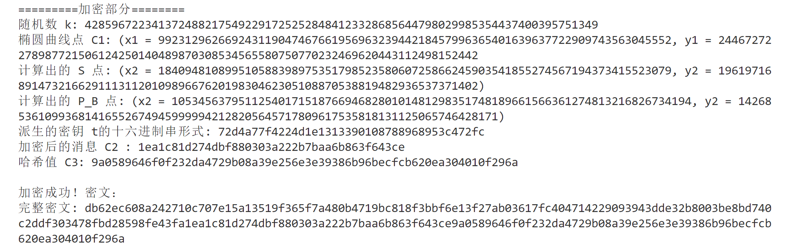

## SM2加密算法实验报告

##### 202202010212

##### 保密2201

##### 罗贝妮

#### 一、算法介绍

##### 1. **SM2 加密算法概述**

SM2 是中国国家密码管理局（SCA）发布的国家密码标准，基于椭圆曲线公钥密码体制（ECC，Elliptic Curve Cryptography），它包含了公钥加密、数字签名和密钥交换等算法。SM2 标准中采用了椭圆曲线 `sm2p256v1`，其安全性基于离散对数问题的困难性，具有较高的计算效率和安全性，被广泛应用于中国的电子政务、金融等领域。

SM2 的加密算法部分是对基于椭圆曲线的公钥加密算法的一种改进，类似于国际通用的 ECC 算法。与传统的 RSA 加密算法相比，SM2 具有更高的安全性和更短的密钥长度，在相同的安全等级下，SM2 的计算速度更快，资源占用更少，适合在资源受限的环境中使用。

##### 2. **椭圆曲线加密基础**

SM2 加密算法基于椭圆曲线密码体制，其核心思想是在有限域上定义椭圆曲线，并利用椭圆曲线上的点加法和标量乘法来实现加密、解密和密钥交换操作。

+ **椭圆曲线方程**：在有限域上的椭圆曲线通常使用如下 Weierstrass 方程表示：
  $$
  E: y^2 = x^3 + ax + b \pmod{p}
  $$
  其中，`a` 和 `b` 是椭圆曲线的参数，`p` 是定义曲线的素数（有限域的大小），曲线上的点满足此方程。
  
+ **椭圆曲线加法**：椭圆曲线上的两个点可以通过定义的几何加法规则进行加法操作，得到新的点。

+ **椭圆曲线点倍乘**：给定曲线上的一个点 `P` 和一个整数 `k`，可以通过重复加法计算得到 `kP`。这一运算是椭圆曲线密码学的基础，构成了加密和解密算法的核心。

##### 3. **SM2 椭圆曲线参数**

SM2 使用的标准椭圆曲线被为 sm2p256v1,基本参数如下:

```python
p = 0xFFFFFFFEFFFFFFFFFFFFFFFFFFFFFFFFFFFFFFFF00000000FFFFFFFFFFFFFFFF
a = 0xFFFFFFFEFFFFFFFFFFFFFFFFFFFFFFFFFFFFFFFF00000000FFFFFFFFFFFFFFFC
b = 0x28E9FA9E9D9F5E344D5A9E4BC42E3D4D6CF78E8E1A1A7F9B8EE7EB4A7C0F9E61
n = 0xFFFFFFFEFFFFFFFFFFFFFFFFFFFFFFFF7203DF6B21C6052B53BBF40939D54123
Gx = 0x32C4AE2C1F1981195F9904466A39C9948FE30BBFF2660BE1714104C9C3E6B041
Gy = 0xBC3736A2F4F6779C59BDCEE36B692153D0A9877CC62A474002DF32E52139F0A0
```

#### 二、算法流程

假设用户A要向用户B发送消息，消息为比特串*M*，len*为*M的长度。

用随机数发生器产生随机数*dB*∈[1,n-1]，其中n是椭圆曲线基点*G*的阶，则*dB*为用户保留的私钥，公钥为*PB*，*PB*=[*dB*]*G*，即基点的*dB*倍点运算

##### 1.SM2 加密算法流程

输入：需要发送的消息为比特串M，klen为M的比特长度。

A1.用随机数发生器产生随机数k∈[1,n-1], 其中n是椭圆曲线基点G的阶；

A2.计算椭圆曲线点C1=[k]G=(x1 ,y1)，将C1的数据类型转换为比特串；

A3.计算椭圆曲线点S=[h]PB，其中h为余因子，若S是无穷远点，则报错并退

出；

A4.计算椭圆曲线点[k]PB=(x2 ,y2)，将坐标x2、y2的数据类型转换为比特串；

A5.计算t=KDF(x2 || y2 , klen)，若t为全0比特串，则返回A1；(||为连接符号)

A6.计算C2 = M ⊕ t

A7.计算C3 = Hash(x2 || M || y2)

A8.输出密文C = C1 || C2 || C3

!

##### 2.SM2解密算法流程

klen为密文中C2的比特长度,对密文C=C1||C2||C3进行解密,需要实现以下步骤

1.从C中取出比特串C1，将C1的数据类型转换为椭圆曲线上的点，验证C1是否满足椭

圆曲线方程，若不满足则报错并退出；

2.计算椭圆曲线点S=[h]C1，若S是无穷远点，则报错并退出；

3.计算[dB]C1=(x2,y2)，将坐标x2、y2的数据类型转换为比特串；

4.计算t=KDF(x2||y2,klen)，若t为全0比特串，则报错并退出；

5.从C中取出比特串C2，计算M′=C2⊕t；

6.计算u=Hash(x2||M′||y2)，从C中取出比特串C3，若u=C3，则报错并退出；

7.输出明文M′




##### 3.密钥派生函数

密钥派生函数的作用是从一个共享的秘密比特串中派生出密钥。在密钥协商过程中,密钥派生函数将所获取的会话密钥或进一步加密所需的密钥。


#### 三.算法代码实现

```python
import random
from math import ceil
from gmssl import sm3,func

# SM2 椭圆曲线参数(使用普遍标准sm2p256v1)
p = 0xFFFFFFFEFFFFFFFFFFFFFFFFFFFFFFFFFFFFFFFF00000000FFFFFFFFFFFFFFFF
a = 0xFFFFFFFEFFFFFFFFFFFFFFFFFFFFFFFFFFFFFFFF00000000FFFFFFFFFFFFFFFC
b = 0x28E9FA9E9D9F5E344D5A9E4BC42E3D4D6CF78E8E1A1A7F9B8EE7EB4A7C0F9E61
n = 0xFFFFFFFEFFFFFFFFFFFFFFFFFFFFFFFF7203DF6B21C6052B53BBF40939D54123
Gx = 0x32C4AE2C1F1981195F9904466A39C9948FE30BBFF2660BE1714104C9C3E6B041
Gy = 0xBC3736A2F4F6779C59BDCEE36B692153D0A9877CC62A474002DF32E52139F0A0

###############格式转换函数#################
# 整数到比特串
def int_to_bits(x):
    x_bits = bin(x)[2:]
    k = ceil(len(x_bits)/8)         # 8位1组，k是组数。目的是方便对齐
    x_bits = x_bits.rjust(k*8, '0')
    return x_bits

# 将字节串转换为比特串
def bytes_to_bits(byte_data):
    return ''.join(f'{byte:08b}' for byte in byte_data) #每一个字节填充为8位长的二进制比特串

# 将比特串转换为字节串
def bits_to_bytes(bit_data):
    byte_data = bytearray()
    for i in range(0, len(bit_data), 8):
        byte_data.append(int(bit_data[i:i+8], 2))
    return bytes(byte_data)


# 字节串到十六进制串
def bytes_to_hex(m):
    h_list = []         # h_list存储十六进制串中的每一部分
    for i in m:
        e = hex(i)[2:].rjust(2, '0')            # 不能把0丢掉
        h_list.append(e)
    h = ''.join(h_list)
    return h


# 比特串到十六进制
def bits_to_hex(s):
    s_bytes = bits_to_bytes(s)
    s_hex = bytes_to_hex(s_bytes)
    return s_hex


# 十六进制串到比特串
def hex_to_bits(h):
    b_list = []
    for i in h:
        b = bin(eval('0x' + i))[2:].rjust(4, '0')           # 增强型for循环，是i不是h
        b_list.append(b)
    b = ''.join(b_list)
    return b


# 十六进制到字节串
def hex_to_bytes(h):
    h_bits = hex_to_bits(h)
    h_bytes = bits_to_bytes(h_bits)
    return h_bytes

###################椭圆曲线上的运算###############
# 椭圆曲线上的点
class Point:
    def __init__(self, x, y):
        self.x = x
        self.y = y
    def is_infinity(self):
        return self.x is None and self.y is None

# 验证某个点是否在椭圆曲线上,椭圆的参数是全局变量
def on_curve(P):
 
    x, y = P
    if pow(y, 2, p) == ((pow(x, 3, p) + a*x + b) % p):
        return True
    return False

# 椭圆曲线加法
def point_add(P, Q):
    if P is None: 
        return Q
    if Q is None:
        return P
    if P.x == Q.x and P.y != Q.y:
        print("无穷远点!!")
        return None  # 返回无穷远点

    if P.x == Q.x:
        #  P == Q:使用点倍加公式
        lam = (3 * P.x * P.x + a) * pow(2 * P.y, p - 2, p)
    else:
        # 一般情况使用普通点加公式
        lam = (Q.y - P.y) * pow(Q.x - P.x, p - 2, p)

    lam %= p
    x_r = (lam * lam - P.x - Q.x) % p
    y_r = (lam * (P.x - x_r) - P.y) % p
    return Point(x_r, y_r)

# 椭圆曲线点倍加
def point_mult(k, P):
    R = None
    T = P
    while k > 0: #通过k移位进行点倍加而不是遍历加
        if k & 1: 
            R = point_add(R, T)
        T = point_add(T, T)
        k >>= 1
    return R

# 椭圆曲线上的基点
G = Point(Gx, Gy)

###############正式步骤及函数##############
###sm3哈希函数
def sm3_hash(data):
    data_bytes = func.bytes_to_list(data)
    hash_hex = sm3.sm3_hash(data_bytes)
    hash_bytes = bytes.fromhex(hash_hex)
    return hash_bytes

# 密钥派生函数（KDF）
def KDF(Z, klen):
    v = 256           # 密码杂凑函数采用SM3
    if klen >= (pow(2, 32) - 1) * v:
        raise Exception("密钥派生函数KDF出错，请检查klen的大小！")
    ct = 0x00000001
    if klen % v == 0:
        l = klen // v
    else:
        l = klen // v + 1
    Ha = []
    for i in range(l):         # i从0到 klen/v-1（向上取整）,共l个元素
        s = Z + int_to_bits(ct).rjust(32, '0')         # s存储 Z || ct 的比特串形式 
        s_bytes = bits_to_bytes(s)          # s_bytes存储字节串形式
        s_list = [i for i in s_bytes]
        hash_hex = sm3.sm3_hash(s_list)
        hash_bin = hex_to_bits(hash_hex)
        Ha.append(hash_bin)
        ct += 1
    if klen % v != 0: #不能整除则只取klen长苏借调最后一个哈希值的剩余部分
        Ha[-1] = Ha[-1][:klen - v*(klen//v)]
    k = ''.join(Ha)
    return k


#####SM2 加密函数
def sm2_encrypt(PB, M):
    print("=========加密部分========")

    # A1: 生成随机数 k
    k = random.randint(1, n - 1)  
    print(f"随机数 k: {k}")

    # A2: 计算椭圆曲线点 C1 = [k]G
    C1 = point_mult(k, G)
    x1_bytes = C1.x.to_bytes(32, 'big')
    y1_bytes = C1.y.to_bytes(32, 'big')
    x1_bits = bytes_to_bits(x1_bytes)
    y1_bits = bytes_to_bits(y1_bytes)
    print(f"椭圆曲线点 C1: (x1 = {C1.x}, y1 = {C1.y}")
       
    # A3: 计算 S = [h]PB
    h = 1  # 通常为 1
    S = point_mult(h, PB)
    if S.is_infinity():
        raise ValueError("S 是无穷远点，报错退出")
    print(f"计算出的 S 点: (x2 = {S.x}, y2 = {S.y})")

    # A4: 计算 P_B = [k]PB
    P_B = point_mult(k, PB)
    x2_bytes = P_B.x.to_bytes(32, 'big')
    y2_bytes = P_B.y.to_bytes(32, 'big')
    x2_bits = bytes_to_bits(x2_bytes)
    y2_bits = bytes_to_bits(y2_bytes)
    print(f"计算出的 P_B 点: (x2 = {P_B.x}, y2 = {P_B.y})")

    # A5: 计算 t = KDF(x2 || y2, klen)
    klen = len(M) * 8  # 消息 M 的比特长度
    t = KDF(x2_bits + y2_bits, klen)
    if int(t, 2) == 0:  # 若 t 是全 0 比特串
        print("生成的密钥 t 为全 0 比特串，重新生成 k")
        return sm2_encrypt(PB, M)  # 递归重新加密
    print(f"派生的密钥 t的十六进制串形式: {bits_to_hex(t)}")

    # A6: 计算 C2 = M ⊕ t
    M_bits = bytes_to_bits(M)  # 将消息 M 转换为比特串
    C2_bits = ''.join('1' if m != t_i else '0' for m, t_i in zip(M_bits, t))  # 逐位异或
    C2_bytes=bits_to_bytes(C2_bits)
    print(f"加密后的消息 C2 : {bits_to_hex(C2_bits)}")

    # A7: 计算 C3 = Hash(x2 || M || y2)
    C3 = sm3_hash(bits_to_bytes(x2_bits + M_bits + y2_bits))  # 计算哈希值
    print(f"哈希值 C3: {C3.hex()}")

    # A8: 输出密文 C = C1 || C2 || C3
    C1_bits = x1_bits + y1_bits  # 拼接 C1 的比特串
    complete_cipher = C1_bits + C2_bits + bytes_to_bits(C3)
    return complete_cipher


def sm2_decrypt(dB, C):
    print("==========解密部分==========")

    # A1: 从密文中提取比特串 C1
    C1_bits = C[:512]  # 提取前 512 位为 C1 的比特串
    x1_bytes = bits_to_bytes(C1_bits[:256])
    y1_bytes = bits_to_bytes(C1_bits[256:])
    x1 = int.from_bytes(x1_bytes, 'big')
    y1 = int.from_bytes(y1_bytes, 'big')
    C1 = Point(x1, y1)

    # A2:验证C1是否在椭圆曲线上
    if not (C1):
        print("C1不在椭圆曲线的点上")
    print(f"椭圆曲线点 C1: (x1 = {C1.x}, y1 = {C1.y})")

    # A3: 计算 P_B = [dB]C1
    P_B = point_mult(dB, C1)
    x2_bytes = P_B.x.to_bytes(32, 'big')
    y2_bytes = P_B.y.to_bytes(32, 'big')
    x2_bits = bytes_to_bits(x2_bytes)
    y2_bits = bytes_to_bits(y2_bytes)
    x2_hex=bits_to_hex(x2_bits)
    y2_hex=bits_to_hex(y2_bits)
    print("解密得到的[dB]C1=(x2,y2)的十六进制串形式是：", (x2_hex, y2_hex))

    # A4: 计算 t = KDF(x2 || y2, klen)
    C2_bits = C[512:-256]  # 提取 C2 的比特串(C1和C3的长度确定因此得到C2)
    C2_hex=bits_to_hex(C2_bits)
    print("C2的十六进制串形式是：", C2_hex)
    klen = len(C2_bits)
    t = KDF(x2_bits + y2_bits, klen)
    print(f"派生的密钥 t的十六进制串形式: {bits_to_hex(t)}")

    # A5: 从密文中提取比特串 C2，计算 M = C2 ⊕ t
    M_bits = ''.join('1' if c2 != t_i else '0' for c2, t_i in zip(C2_bits, t))  # 逐位异或
    M = bits_to_bytes(M_bits)

    # A6: 验证 C3
    C3_bits = C[-256:]  # 提取 C3 的比特串
    C3_hex=bits_to_hex(C3_bits)
    print("从C中取出的C3的十六进制形式是：", C3_hex)
    u_bytes = sm3_hash(bits_to_bytes(x2_bits + M_bits + y2_bits)) #计算u验证是否与C3相等
    print("计算的u = Hash(x2 ∥ M′ ∥ y2)是：", bytes_to_hex(u_bytes))
    if u_bytes != bits_to_bytes(C3_bits):
        raise ValueError("验证失败，C3 不匹配，解密失败")
    print("C3验证成功!")
    return M

# 生成密钥对
def generate_keypair():
    dB = random.randint(1, n - 1)
    PB = point_mult(dB, G)
    return dB, PB

    
######测试加密解密算法
def test_sm2():
    print("==== 开始测试 SM2 加密与解密 ====\n")
    
    # 生成一对密钥
    dB, PB = generate_keypair()

    # 获取用户输入的明文消息
    M = input("请输入要加密的 ASCII 明文字符串: ")
    
    # 将明文字符串转换为字节流
    M_bytes = M.encode('ascii')
    print(f"明文消息（字节形式）: {M_bytes}\n")

    # 加密
    complete_cipher = sm2_encrypt(PB, M_bytes)
    print("\n加密成功！：")
    print(f"完整密文: {bits_to_hex(complete_cipher)}\n")

    # 解密
    decrypted_message_bytes = sm2_decrypt(dB, complete_cipher)
    decrypted_message = decrypted_message_bytes.decode('ascii')
    print(f"\n解密成功！明文：{decrypted_message}\n")

# 运行测试
test_sm2()
```

#### 四.代码运行

加密我的姓名+学号(输入形式是ascii码编码的字符串)

```
luobeini202202010212
```

加密部分输出:



解密部分输出:


