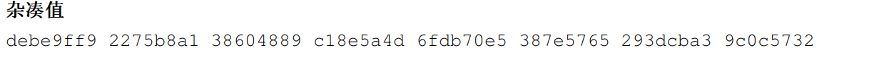

### 实现SM3加密算法实验报告

##### 202202010212

##### 保密2201

##### 罗贝妮

#### SM3概述

SM3密码杂凑算法是中国国家密码管理局2010年公布的中国商用密码杂凑算法标准。具体算法标准原始文本参见。该算法于2012年发布为密码行业标准(GM/T 0004-2012)，2016年发布为国家密码杂凑算法标准(GB/T 32905-2016)。

SM3适用于商用密码应用中的数字签名和验证，是在[SHA-256]基础上改进实现的一种算法，其安全性和SHA-256相当。SM3和MD5的迭代过程类似，也采用Merkle-Damgard结构。消息分组长度为512位，摘要值长度为256位。

整个算法的执行过程可以概括成四个步骤：消息填充、消息扩展、迭代压缩、输出结果。‘

#### 算法过程

##### 消息填充

SM3的消息扩展步骤是以512位的数据分组作为输入的。因此，我们需要在一开始就把数据长度填充至512位的倍数。数据填充规则和MD5一样，具体步骤如下：

1、先填充一个“1”，后面加上k个“0”。其中k是满足(n+1+k) mod 512 = 448的最小正整数。

2、追加64位的数据长度（bit为单位，大端序存放）

##### 消息扩展

SM3的迭代压缩步骤没有直接使用数据分组进行运算，而是使用这个步骤产生的132个消息字。（一个消息字的长度为32位/4个字节/8个16j进制数字）概括来说，先将一个512位数据分组划分为16个消息字，并且作为生成的132个消息字的前16个。再**用这16个消息字递推生成剩余的116个消息字**。

在最终得到的132个消息字中，前68个消息字构成数列 {W j {W_j}Wj}，后64个消息字构成数列 {W j ‘ {W_j^`}Wj‘}，其中下标j从0开始计数。


迭代压缩

用布尔函数、非线性函数和循环移位等操作对每一个消息分组进行压缩，过程如图：


  

输出结果

将得到的A、B、C、D、E、F、G、H八个变量拼接输出，就是SM3算法的输出。


### 代码实现


```python
import struct

# IV初始值
IV = [
    0x7380166F, 0x4914B2B9, 0x172442D7, 0xDA8A0600,
    0xA96F30BC, 0x163138AA, 0xE38DEE4D, 0xB0FB0E4E
]

# T初始化
T = [0x79CC4519 if i < 16 else 0x7A879D8A for i in range(64)]

# 循环左移函数，n 表示左移的位数
def left_rotate(x, n):
    return ((x << n) & 0xFFFFFFFF) | ((x >> (32 - n)) & 0xFFFFFFFF)

# 填充函数
def padding(message):
    message_len = len(message) * 8 
    message.append(0x80)  # 添加 '1' 比特

    # 填充 '0' 比特，直到message_len mod 512=448
    message.extend([0x00] * ((56 - len(message) % 64) % 64))

    # 添加message_len的64位表示
    message += struct.pack('>Q', message_len)
    return message

# 消息扩展函数，将 512 位的消息扩展为 132 个 32 位字
def message_extension(block):
    W = list(struct.unpack('>16L', block))  # 解析 16 个字
    for i in range(16, 68):
        W.append(P1(W[i - 16] ^ W[i - 9] ^ left_rotate(W[i - 3], 15)) ^
                 left_rotate(W[i - 13], 7) ^ W[i - 6])

    W_ = [W[i] ^ W[i + 4] for i in range(64)]
    return W, W_

# P1
def P1(X):
    return X ^ left_rotate(X, 15) ^ left_rotate(X, 23)

#P0
def P0(X):
    return X ^ left_rotate(X, 9) ^ left_rotate(X, 17)

# 布尔函数FF
def FF(X, Y, Z, j):
    return (X ^ Y ^ Z) if j < 16 else ((X & Y) | (X & Z) | (Y & Z))

# 布尔函数GG
def GG(X, Y, Z, j):
    return (X ^ Y ^ Z) if j < 16 else ((X & Y) | (~X & Z))

# 压缩函数
def compress(V, B):
    W, W_ = message_extension(B)
    A, B, C, D, E, F, G, H = V

    # 64 轮压缩操作
    for j in range(64):
        SS1 = left_rotate((left_rotate(A, 12) + E + left_rotate(T[j], j % 32)) & 0xFFFFFFFF, 7)
        SS2 = SS1 ^ left_rotate(A, 12)
        TT1 = (FF(A, B, C, j) + D + SS2 + W_[j]) & 0xFFFFFFFF
        TT2 = (GG(E, F, G, j) + H + SS1 + W[j]) & 0xFFFFFFFF
        D = C
        C = left_rotate(B, 9)
        B = A
        A = TT1
        H = G
        G = left_rotate(F, 19)
        F = E
        E = P0(TT2)

    return [(V[i] ^ var) & 0xFFFFFFFF for i, var in enumerate([A, B, C, D, E, F, G, H])]

# 计算 SM3 哈希值
def sm3_hash(message):
    # 填充
    padded_message = padding(message)
    blocks = [padded_message[i:i + 64] for i in range(0, len(padded_message), 64)]
    V = IV

    #压缩
    for block in blocks:
        V = compress(V, block)

    # 将最终结果 V 转换为 16 进制字符串
    return ''.join(f'{x:08x}' for x in V)

# 将十六进制表示的消息转换为字节
def convert_hex_input(hex_input):
    # 移除空格并将每两个字符转换为一个字节
    hex_string = hex_input.replace(" ", "")
    return bytearray.fromhex(hex_string)

# 判断输入是普通字符串还是十六进制字符串
def process_input(input_data):
   
    is_hex_string = all(c in "0123456789abcdefABCDEF " for c in input_data)
    
    if is_hex_string:
        try:
            return convert_hex_input(input_data)
        except ValueError:
            pass
    
    return bytearray(input_data, 'utf-8')

# 输入可以是普通字符串或空格分隔的十六进制字符串
input_data = input("请输入要加密的消息: ")
message_bytes = process_input(input_data)
# 计算 SM3 哈希值
result = sm3_hash(message_bytes)
print(f"SM3 哈希值: {result}")
```

### 测试

先运行国标文件中的示例(中间结果过长,此处就只放出原始消息和加密后的结果):

1.示例1,加密不足512bit的消息


答案符合

2.示例2,加密512bit的消息:





答案符合

3.加密我的姓名和学号

