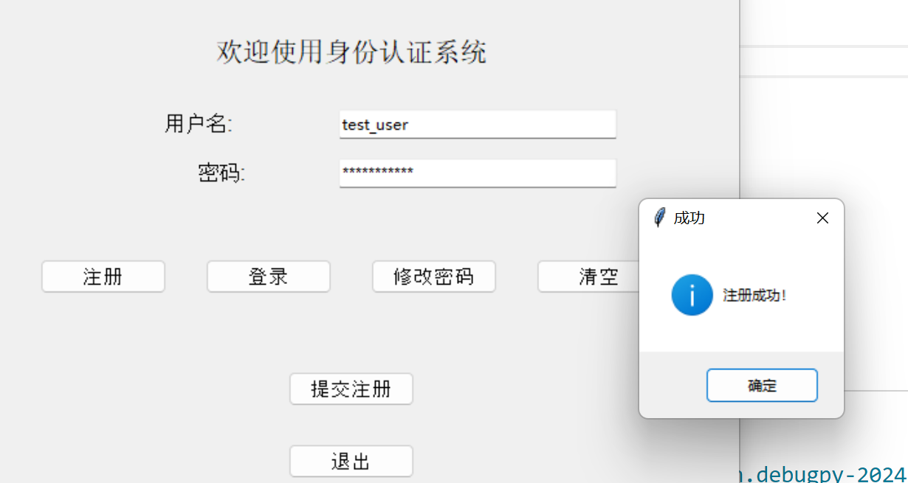

# 基于 Python 的身份认证系统设计与实现

##### 202202010212

##### 保密2201

##### 罗贝妮

## 1. 实验目的

本实验旨在通过使用 Python 和 Tkinter 构建一个简单的身份认证系统，熟悉身份认证的基本流程，包括用户注册、登录、修改密码等操作。通过实验，理解如何设计用户界面、与数据库交互以及处理用户的认证请求。

## 2. 实验功能

本实验的身份认证系统包括以下功能模块：

- **注册**：用户输入用户名和密码，注册新账户。
- **登录**：用户输入注册时的用户名和密码，验证后登录系统。
- **修改密码**：用户通过输入旧密码和新密码来修改账户密码。
- **密码强度验证：**用户输入的密码必须包含字母和数字且要超过八位

## 3. 实验步骤

### 3.1 系统设计

#### 4.1.1  功能模块

- **用户注册**：用户填写用户名和密码，系统检查用户名是否已存在，如果不存在则将用户名和密码存入数据库，检查密码强度，位数需要大于8位且必须包含数字和字母
- **用户登录**：用户填写用户名和密码，系统从数据库中验证用户名和密码是否匹配。
- **修改密码**：用户需要输入旧密码和新密码，验证旧密码正确后，系统更新数据库中的密码记录。

#### 4.1.2 数据库设计

使用 SQLite 数据库来存储用户的认证信息。数据库包含一个用户表 `users`，表结构如下：

| 字段名   | 类型 | 说明                                                   |
| -------- | ---- | ------------------------------------------------------ |
| username | TEXT | 用户名，主键，不可为空（NOT NULL）                     |
| password | TEXT | 用户密码和盐值加密后（`NOT NULL`）                     |
| salt     | TEXT | 存储用于加密用户密码的随机盐值。不可为空（`NOT NULL`） |


#### 4.1.3 GUI 设计

使用 Tkinter 库设计图形用户界面，提供用户友好的交互界面。界面包含输入用户名、输入密码、选择操作（注册、登录、修改密码）的按钮和文本框。

### 4.2 实现步骤

##### 实现代码概述：

代码实现了一个基于 **SQLite** 数据库的用户认证系统，主要功能包括：

- 用户注册（`register_user`）：创建新用户并存储用户名、密码哈希及盐值。
- 用户登录（`login_user`）：验证用户输入的用户名和密码是否匹配。
- 修改密码（`change_password`）：允许用户更新密码。
- 数据库初始化（`init_db`）：创建存储用户信息的数据库表。
- 密码强度校验（`is_valid_password`）：验证密码是否符合安全性要求。
- 密码哈希（`hash_password`）：使用 **SM3** 算法结合随机盐值对密码进行哈希处理。
- 盐值加密：让密码和系统生成的随机盐值结合再进行哈希运算，可防止两个用户密码相同时易被推断


##### （1） 数据库初始化

该函数用于初始化用户信息的数据库，确保程序运行前数据库表已存在：

```python
def init_db():
    try:
        with sqlite3.connect(DB_NAME) as conn:
            cursor = conn.cursor()
            cursor.execute('''
                CREATE TABLE IF NOT EXISTS users (
                    username TEXT PRIMARY KEY,
                    password_hash TEXT NOT NULL,
                    salt TEXT NOT NULL
                )
            ''')
            conn.commit()
    except sqlite3.Error as e:
        print(f"数据库初始化失败: {e}")
```

- 数据库名为 `users.db`。
- 表结构包含 `username`（用户名）、`password_hash`（密码哈希）和 `salt`（随机盐值）。
- 使用了 SQLite 的 `CREATE TABLE IF NOT EXISTS` 语句，避免重复创建表。

##### **（2）用户注册：`register_user(username, password)`**

实现用户注册功能，包含以下步骤：

1. 校验输入的用户名和密码是否为空。
2. 验证密码强度（使用 `is_valid_password` 函数）。
3. 检查用户名是否已存在（通过 `user_exists` 函数）。
4. 为用户生成随机盐值，并使用 `hash_password` 函数对密码进行哈希处理。
5. 将用户名、密码哈希和盐值存入数据库。

代码：

```python
def register_user(username, password):
    """
    注册新用户
    :param username: 用户名
    :param password: 密码
    :return: (boolean, message) 注册是否成功及信息
    """
    if not username or not password:
        return False, '用户名和密码不能为空！'

    if not is_valid_password(password):
        return False, '密码强度不足，需包含字母和数字，长度至少8位！'

    if user_exists(username):
        return False, '用户名已存在！'

    # 生成随机盐值
    salt = uuid.uuid4().hex
    password_hash = hash_password(password, salt)

    try:
        with sqlite3.connect(DB_NAME) as conn:
            cursor = conn.cursor()
            # 存储新用户
            cursor.execute('INSERT INTO users (username, password_hash, salt) VALUES (?, ?, ?)', (username, password_hash, salt))
            conn.commit()
        return True, '注册成功！'
    except sqlite3.Error as e:
        return False, f'注册失败，数据库错误: {e}'
```

- **安全性设计**：
  - 使用随机盐值增强密码哈希的抗碰撞性。
  - 使用了国密算法 **SM3** 进行哈希。

---

##### （3）**用户登录：`login_user(username, password)`**

实现用户身份验证的功能，包含以下步骤：

1. 查询数据库中是否存在该用户名。
2. 获取对应的密码哈希值和盐值。
3. 对用户输入的密码进行相同的哈希处理，并与数据库中的哈希值进行比对。

代码：

```python
cursor.execute('SELECT password_hash, salt FROM users WHERE username=?', (username,))
password_hash_input = hash_password(password, salt)  # 对输入密码进行哈希
if password_hash_input == stored_password_hash:
    return True, '登录成功！'
else:
    return False, '密码错误！'
```

- **安全性设计**：
  - 使用盐值和哈希组合，避免彩虹表攻击。
  - 比对过程中避免直接存储明文密码。

---

##### （4）**修改密码：`change_password(username, new_password)`**

实现更新用户密码的功能，包含以下步骤：

1. 检查用户名是否有效，密码是否符合强度要求。
2. 生成新的随机盐值，并对新密码进行哈希处理。
3. 更新数据库中的密码哈希值和盐值。

核心代码：

```python
new_salt = uuid.uuid4().hex  # 生成新盐值
new_password_hash = hash_password(new_password, new_salt)  # 哈希新密码
cursor.execute('UPDATE users SET password_hash=?, salt=? WHERE username=?', 
               (new_password_hash, new_salt, username))
```

---

##### （5）**检查用户名是否存在：`user_exists(username)`**

通过查询数据库判断用户名是否已被注册：

```python
cursor.execute('SELECT 1 FROM users WHERE username=?', (username,))
return cursor.fetchone() is not None
```

返回布尔值：

- `True` 表示用户名已存在。
- `False` 表示用户名可用。

---

##### （6）**密码哈希：`hash_password(password, salt)`**

对密码进行哈希处理，增强安全性：

```python
combined = password + salt  # 密码和盐值组合
hash_bytes = combined.encode('utf-8')  # 转为字节
hash_hex = sm3.sm3_hash(func.bytes_to_list(hash_bytes))  # 使用SM3算法进行哈希
```

- **盐值**：随机生成的字符串，通过 `uuid.uuid4().hex` 获取。
- **哈希算法**：SM3 是一种国密哈希算法，输出固定长度的哈希值。

---

##### （7）**密码强度校验：`is_valid_password(password)`**

校验密码是否符合以下要求：

1. 至少包含 8 个字符。
2. 必须包含字母和数字。

```python
if len(password) < 8:
    return False
if not re.search(r'[A-Za-z]', password):  # 检查是否包含字母
    return False
if not re.search(r'\d', password):  # 检查是否包含数字
    return False
return True
```

- 密码强度不足时，函数返回 `False`。

#### 4.2.5 图形用户界面 (GUI)

通过 Tkinter 库设计身份认证系统的 GUI，主要结构如下：

+ GUI 主框架的创建与布局
  create_gui() 是整个程序的入口函数，它创建了主窗口和主要的 GUI 组件：
  使用 tk.Tk() 创建窗口。
  布局和样式设置，包括标题、输入框、按钮等。
2. 动态界面切换
程序通过以下函数实现界面的动态切换：
hide_all_fields()：隐藏所有动态字段和按钮。
show_register()：显示注册界面。
show_login()：显示登录界面。
show_change_password()：显示修改密码界面。
这些函数通过调用 grid_forget() 或 grid() 方法来控制控件的显示和隐藏。
3. 用户交互的逻辑处理
程序通过以下函数处理用户的输入与交互：
register_user_handler()：处理用户注册逻辑。
login_user_handler()：处理用户登录逻辑。
change_password_handler()：处理用户修改密码逻辑。
clear_entries()：清空所有输入框。
用户的输入通过 entry.get() 方法获取，并调用对应的逻辑函数（如 register_user()、login_user()、change_password()）进行处理。
4. 消息提示与反馈
使用 messagebox 提供反馈给用户：
showwarning()：弹出警告提示。
showinfo()：弹出成功提示。
showerror()：弹出错误提示。

#### 4.2.6 把文件用nano传给云主机


###  4.3 实验测试

#### 4.3.1 测试用户注册

1. 启动程序，输入用户名 `test_user` 和密码 `password123`。

2. 点击“注册”按钮，程序显示“用户注册成功”提示。

   

3. 再次尝试注册相同的用户名，程序显示“用户名已存在”。

   

4.密码强度不够时


####  4.3.2 测试用户登录

1. 输入已注册的用户名 `test_user` 和正确的密码 `password123`。

2. 点击“登录”按钮，程序显示“登录成功”。

3. 

4. 输入错误的密码，程序显示“用户名或密码错误”。

   

#### 4.3.3 测试修改密码

1. 在注册用户后，输入用户名 `test_user`、旧密码 `password123` 和新密码 `password456`。

2. 点击“修改密码”按钮，程序显示“密码修改成功”。

   

   

3. 使用新密码登录，验证密码修改成功。


## 5. 实验结果及分析

通过本次实验，实现了一个简单的身份认证系统，包含了用户注册、登录和修改密码的基本功能。实验结果如下：

1. **用户注册**：系统能够成功验证用户名的唯一性，并将用户名和密码正确存储到数据库中。
2. **用户登录**：系统能够验证用户名和密码的正确性，并给出相应的提示。
3. **修改密码**：系统能够通过验证旧密码来修改用户的密码，并更新数据库中的记录。

整个系统基于 SQLite 数据库，具有较好的可移植性，适合轻量级应用场景。通过 Tkinter 图形界面，用户能够方便地进行操作，提升了用户体验。

## 6. 实验过程总结及遇到的问题

**总结：**

1. 设计思路主要来源于生活中遇到的各种各样的账号注册及登录，这个开始的比较早，所以完善时间较长，一开始只有注册和登录功能，后面才加入了前端界面的设计，响应消息，密码修改，密码强度验证等功能

2. 这次的系统的加密过程比较简单，只有哈希以及随机盐值，加密强度可能还不够，有想过加上SM2但是没有想到怎么使用SM2和SM3一起进行认证

3. 通过这次实验对于简单的身份认证系统的架构有了更清晰的认知，关于SQL语言嵌入python，前端的设计有了了解

   ##### 遇到的问题：

   1.gui部分界面的框架按键的位置以及输入框的设置遇到了问题，修改密码界面总是无法显示label_new_password和entry_new_password这一栏，最后发现是因为网格布局的行分配冲突导致的。一开始button_frame 被放置在 main_frame 的第 3 行，而在显示修改密码界面时，label_new_password和 entry_new_password 也被放置在第 3 行，这会导致新密码输入框被按钮框架覆盖，从而看不到新密码输入框

   2.界面的按键直接的距离以及框架的大小总是会出现问题，调试了很多次

   

